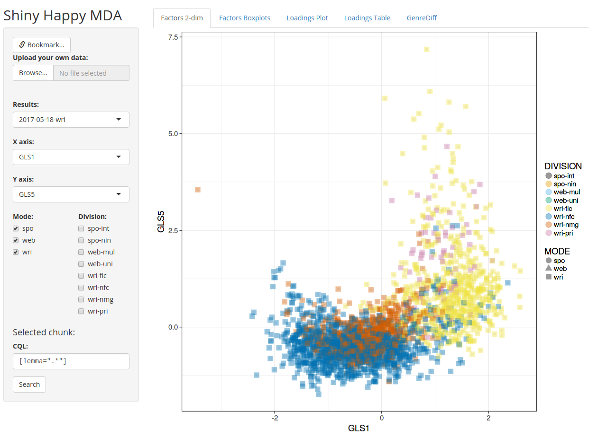

Visualizing MDA results
=======================

Demo
----

A live instance of the app is accessible
at <https://jupyter.korpus.cz/shiny/lukes/mda/>.

What is Multi-Dimensional Analysis (MDA)?
-----------------------------------------

MDA is a data-driven approach to analyzing register variation in language. A
variety of linguistic features are identified in a corpus of diversified texts
and their patterns of co-occurrence are then summarized
using [factor analysis](https://en.wikipedia.org/wiki/Factor_analysis) (or some
other statistical procedure aimed at reduction of dimensionality). Dimensions
of variation in the corpus of texts are thus identified based on text-internal
criteria and subsequently interpreted w.r.t. which linguistic features they
correlate with.

This Shiny app facilitates visual exploration of MDA results, which is intended
to help with the interpretation task.

For a thorough introduction to MDA, see Douglas Biber (1988), *Variation across
speech and writing* (Cambridge: Cambridge University Press).

Running your own instance
-------------------------

This is a fairly standard Shiny app, you just need to give it the factor
analysis results as `*.RData` files under the `./results` directory. These
files are expected to contain a `factors` variable (with the scores of the
individual texts in the corpus w.r.t. the different factors), and a `load`
variable, which is a matrix of the loadings of the individual linguistic
features on the factors (as retrieved from the factor analysis).

I don't suspect this app will be useful outside our project, but don't hesitate
to let me know if you feel otherwise and I'll fill in the details :)

License
-------

Copyright © 2017--present [ÚČNK][cnc]/David Lukeš

Distributed under the [GNU General Public License v3][gplv3]

[cnc]: http://korpus.cz
[gplv3]: http://www.gnu.org/licenses/gpl-3.0.en.html}
